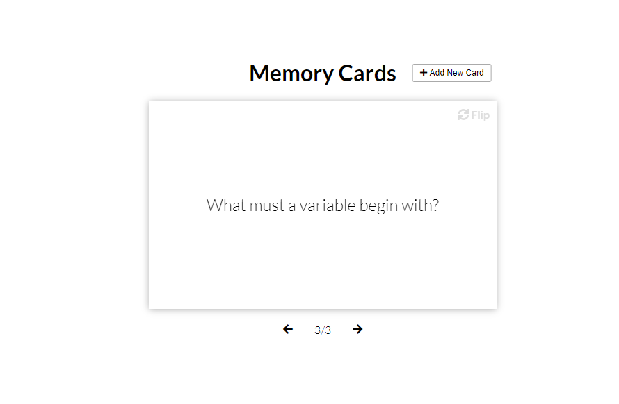

## Memory Cards

Flash card app for learning. Display, add and remove memory cards with questions and answers

## Project Specifications

- Create flip cards using CSS
- Create "Add new card" overlay with form
- Display question cards and flip for answer
- View prev and next cards
- Add new cards to local storage
- Clear all cards from local storage

## Steps to execute this Memory Card:
- Download the entire code 
- Open up the index.html.
- [View Live Site](https://anthonys1760.github.io/Memory-Cards/)

## Technologies used: 
- HTML
- CSS [style/Presentation]
- Javascript [Logic/Working of calculator]

